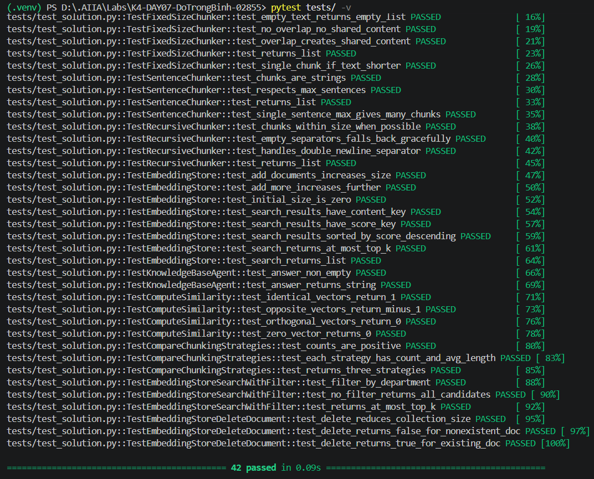

# Báo Cáo Cá Nhân — Lab 7: Embedding & Vector Store

**Họ tên:** Đỗ Trọng Bình
**Nhóm:** FourGuys
**Ngày:** 20/09/2026

> **Nộp 1 bản / sinh viên.** Phần nhóm (lựa chọn tài liệu, thiết kế chiến lược, bộ câu hỏi đánh giá, demo) nộp chung 1 bản trong `REPORT_NHOM.md`. Chi tiết thang điểm: `docs/SCORING.md`.

**Tổng điểm phần cá nhân: 60** = Khởi động (5) + Hướng tiếp cận (10) + Hoàn thiện code (30) + Dự đoán độ tương tự (5) + Kết quả truy xuất của tôi (10).

---

## 1. Khởi động (Warm-up) — Cá nhân (5 điểm)

### Độ tương tự Cosine (Cosine Similarity) (Bài tập 1.1)

**Độ tương tự cosine cao (High cosine similarity) nghĩa là gì?**
> *Viết 1-2 câu:* Cosine similarity cao nghĩa là hai vector embedding gần cùng hướng (góc giữa chúng nhỏ), chúng có ý nghĩa gần nhau, tương tự với nhau cao.

**Ví dụ có độ tương tự CAO:**
- Câu A: Tôi muốn hoàn tiền cho đơn hàng này.
- Câu B: Tôi cần được trả lại tiền cho sản phẩm đã mua.
- Tại sao tương đồng: Hai câu dùng từ khác nhau nhưng cùng yêu cầu hoàn tiền cho một giao dịch mua hàng.

**Ví dụ có độ tương tự THẤP:**
- Câu A: Chính sách đổi trả cho phép khách hàng gửi yêu cầu hoàn tiền.
- Câu B: Đội bóng thắng trận chung kết với tỉ số 2–0.
- Tại sao khác: Hai câu đề cập đến hai chủ đề không liên quan: chính sách thương mại điện tử và kết quả thể thao.

**Tại sao độ tương tự cosine (cosine similarity) được ưu tiên hơn khoảng cách Euclid (Euclidean distance) cho text embeddings?**
> *Viết 1-2 câu:* Cosine đo mức độ cùng hướng của các embedding nên ít bị ảnh hưởng bởi độ lớn vector, vốn có thể thay đổi theo độ dài văn bản hoặc đặc tính của mô hình. Vì truy xuất văn bản thường cần so sánh hướng ngữ nghĩa, cosine thường phù hợp hơn Euclid.

### Bài toán tính toán Chunking (Bài tập 1.2)

**Tài liệu 10,000 ký tự, chunk_size=500, overlap=50. Bao nhiêu chunks?**
> *Trình bày phép tính:* Bước dịch giữa hai chunk là `500 - 50 = 450` ký tự. Số chunk là `ceil((10.000 - 50) / (500 - 50)) = ceil(9.950 / 450) = ceil(22,11...)`.
> *Đáp án:* **23 chunks**. Kết quả này cũng khớp với `FixedSizeChunker(chunk_size=500, overlap=50)` trong repo.

**Nếu độ chồng chéo (overlap) tăng lên 100, số lượng chunk thay đổi thế nào? Tại sao muốn độ chồng chéo nhiều hơn?**
> *Viết 1-2 câu:* Khi overlap là 100, bước dịch còn `500 - 100 = 400`, nên có `ceil((10.000 - 100) / 400) = ceil(24,75) = 25` chunks — tăng từ 23 lên 25. Overlap lớn hơn giúp thông tin ở ranh giới giữa hai chunk xuất hiện ở cả hai phía, giảm nguy cơ tách rời ngữ cảnh hoặc câu trả lời; đổi lại sẽ tạo nhiều vector hơn và tăng chi phí lưu trữ/tìm kiếm.

---

## 2. Hướng tiếp cận của tôi (My Approach) — Cá nhân (10 điểm)

Giải thích cách tiếp cận của bạn khi lập trình (implement) các phần chính trong gói `src`.

### Các hàm chia nhỏ (Chunking Functions)

**`SentenceChunker.chunk`** — hướng tiếp cận:
> Tôi dùng regex `(?<=[.!?])\s+` để tách câu sau dấu `.`, `!` hoặc `?` khi phía sau là khoảng trắng; dấu câu vẫn được giữ lại trong nội dung. Sau đó tôi gom tối đa `max_sentences_per_chunk` câu thành một chunk và loại bỏ khoảng trắng thừa. Nếu văn bản rỗng hoặc chỉ có khoảng trắng thì hàm trả về danh sách rỗng.

**`RecursiveChunker.chunk` / `_split`** — hướng tiếp cận:
> Tôi ưu tiên tách theo đoạn văn (`\n\n`), xuống dòng, câu, khoảng trắng rồi cuối cùng mới cắt cứng theo số ký tự. Với mỗi mức tách, các phần nhỏ liền kề được gom lại đến gần `chunk_size` để tránh tạo ra quá nhiều chunk quá ngắn. Trường hợp cơ sở là khi đoạn đã không dài hơn `chunk_size`; nếu hết separator thì cắt cứng để bảo đảm chunk vẫn có kích thước giới hạn.

### Lớp EmbeddingStore

**`add_documents` + `search`** — hướng tiếp cận:
> Tôi lưu dữ liệu trong một danh sách in-memory; mỗi `Document` được chuẩn hoá thành record gồm `id`, `content`, bản sao `metadata` và `embedding`. Khi thêm tài liệu, embedding được tạo từ nội dung; khi tìm kiếm, query cũng được embedding rồi tính dot product với embedding của từng record. Kết quả được sắp xếp giảm dần theo score và chỉ trả về tối đa `top_k`, không trả embedding để output gọn hơn.

**`search_with_filter` + `delete_document`** — hướng tiếp cận:
> Tôi lọc metadata trước rồi mới similarity search, vì nếu search trước thì các kết quả không đúng điều kiện có thể chiếm hết các vị trí top-k. Hàm `delete_document` giữ lại các record có `metadata['doc_id']` khác id cần xoá, nên có thể xoá toàn bộ chunk thuộc cùng một tài liệu. Hàm trả về `True` khi có ít nhất một chunk đã bị xoá, ngược lại trả về `False`.

### Tác tử KnowledgeBaseAgent

**`answer`** — hướng tiếp cận:
> Tôi lấy các chunk top-k từ store, đánh số từng chunk dạng `[1]`, `[2]`, ... và thêm nguồn của chunk vào ngữ cảnh. Prompt yêu cầu LLM chỉ dùng ngữ cảnh đã cung cấp, không đoán khi thiếu thông tin và trích dẫn số chunk khi trả lời; sau đó prompt được gửi vào `llm_fn`. Nếu không có chunk phù hợp, agent trả thông báo ngay và không gọi LLM.

---

## 3. Hoàn thiện code (Core Implementation) — Cá nhân (30 điểm)

Vượt qua bộ kiểm thử là điều kiện tính điểm phần này.

### Kết Quả Kiểm Thử (Test Results)

```
# Dán kết quả (output) của: pytest tests/ -v
```

**Số lượng bài test vượt qua (pass):** 42 / 42

---

## 4. Dự đoán độ tương tự (Similarity Predictions) — Cá nhân (5 điểm)

| Cặp | Câu A | Câu B | Dự đoán | Điểm thực tế | Đúng? |
|------|-----------|-----------|---------|--------------|-------|
| 1 | Người mua có thể đổi trả miễn phí trong 30 ngày. | Tiki công bố quyền lợi đổi trả miễn phí trong 30 ngày. | Cao | 0,7176 | Có |
| 2 | Nhà bán phải phản hồi yêu cầu C-return trong hai ngày làm việc. | Người bán có 02 ngày làm việc để xác nhận hoặc từ chối yêu cầu. | Cao | 0,7188 | Có |
| 3 | Nhà bán FBT phải rút hàng trong 32 ngày làm việc. | Đội bóng thắng trận chung kết với tỉ số 2-0. | Thấp | 0,2158 | Có |
| 4 | Hàng NGON bị hư hỏng do vận chuyển cần được báo cho Tiki trong 24 giờ. | Nhà bán cần liên hệ Tiki trong 24 giờ để yêu cầu bồi thường hàng hoàn. | Cao | 0,6654 | Có |
| 5 | Chương trình đổi trả 365 ngày áp dụng cho Tiki Trading. | Khách hàng có thể đổi trả hoặc hoàn tiền cho hàng lỗi kỹ thuật trong 365 ngày. | Cao | 0,5766 | Có |

**Kết quả nào bất ngờ nhất? Điều này nói gì về cách embeddings biểu diễn ý nghĩa?**
> Cặp 5 cùng nói về chương trình 365 ngày nhưng score chỉ 0,5766, thấp hơn các cặp cao khác. Điều này cho thấy embedding không chỉ nhìn vào số “365 ngày” mà còn xét các chi tiết đi kèm như Tiki Trading, loại sản phẩm và lỗi kỹ thuật. Vì vậy, hai câu có chung chủ đề vẫn có thể có score vừa phải nếu trọng tâm thông tin khác nhau.

---

## 5. Kết quả truy xuất của tôi (Competition Results) — Cá nhân (10 điểm)

Chạy **5 câu hỏi đánh giá của nhóm** trên mã nguồn cá nhân của bạn trong gói `src`. **5 câu hỏi này phải trùng với các thành viên cùng nhóm** (xem `REPORT_NHOM.md`).

| # | Câu hỏi (Query) | Top-1 Chunk truy xuất được (tóm tắt) | Điểm Score | Có liên quan không? (Relevant) | Câu trả lời của Agent (tóm tắt) |
|---|-------|--------------------------------|-------|-----------|------------------------|
| 1 | Chương trình đổi trả 365 ngày áp dụng cho ngành hàng và nhà bán nào? | Chunk top-1 chỉ có heading chương trình 365 ngày; thông tin phạm vi nằm ở top-2. | 0,7750 | Có, nhưng chưa đủ ở top-1 | Đúng: Điện gia dụng và Thiết bị số thuộc Tiki Trading [2]. |
| 2 | Khi từ chối yêu cầu đổi trả hoặc bảo hành, nhà bán Dropship cần cung cấp những loại bằng chứng hợp lệ nào? | Chunk top-1 chỉ có heading Dropship; bằng chứng đầy đủ nằm ở top-3. | 0,7612 | Có, nhưng chưa đủ ở top-1 | Đúng: biên bản bàn giao/đồng kiểm; ảnh/video; biên bản thẩm định của hãng [3]. |
| 3 | Nhà bán mô hình NGON cần làm gì khi hàng hoàn bị hư hỏng do lỗi vận chuyển? | Chunk top-1 chỉ có heading NGON, không chứa bước liên hệ Tiki trong 24 giờ/bồi thường. | 0,6038 | Không | Không tìm thấy thông tin vì top-3 không chứa section bồi thường cần thiết. |
| 4 | Nhà bán FBT phải sắp xếp rút hàng trong thời hạn bao lâu? | Chunk top-1 chỉ có heading FBT; top-2/top-3 là mốc thời hạn của Dropship. | 0,6279 | Không | Sai: agent trả lời mốc 05 ngày/02 ngày của Dropship, không phải 32 ngày của FBT. |
| 5 | Thời hạn đổi trả miễn phí là bao lâu? | Đổi trả miễn phí 30 ngày, kèm cam kết hoàn 200% nếu hàng giả. | 0,6362 | Có | Đúng: 30 ngày [1]; agent nêu thêm điều kiện riêng của chương trình 365 ngày [2]. |

**Bao nhiêu câu hỏi trả về chunk có liên quan trong top-3?** 3 / 5

**Điều hay nhất tôi học được từ thành viên khác / nhóm khác (qua demo):**
> Tôi nhận ra rằng chunk theo heading không tự động tốt hơn dù tài liệu có cấu trúc rõ ràng. Khi so sánh với FixedSize và Recursive, tôi thấy một chunk chỉ có tiêu đề có thể đứng hạng cao nhưng không chứa dữ kiện trả lời. Bài học là phải kiểm tra nội dung thật của top-3 thay vì chỉ nhìn `doc_id` hoặc score.

---

## Tự Đánh Giá (Phần Cá Nhân)

| Tiêu chí | Điểm tự đánh giá |
|----------|-------------------|
| Khởi động (Warm-up) | / 5 |
| Hướng tiếp cận của tôi (My Approach) | / 10 |
| Hoàn thiện code (Core Implementation — tests) | / 30 |
| Dự đoán độ tương tự (Similarity Predictions) | / 5 |
| Kết quả truy xuất của tôi (Competition Results) | / 10 |
| **Tổng phần cá nhân** | **/ 60** |
